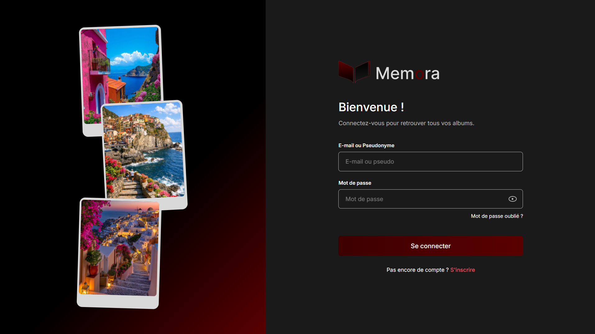
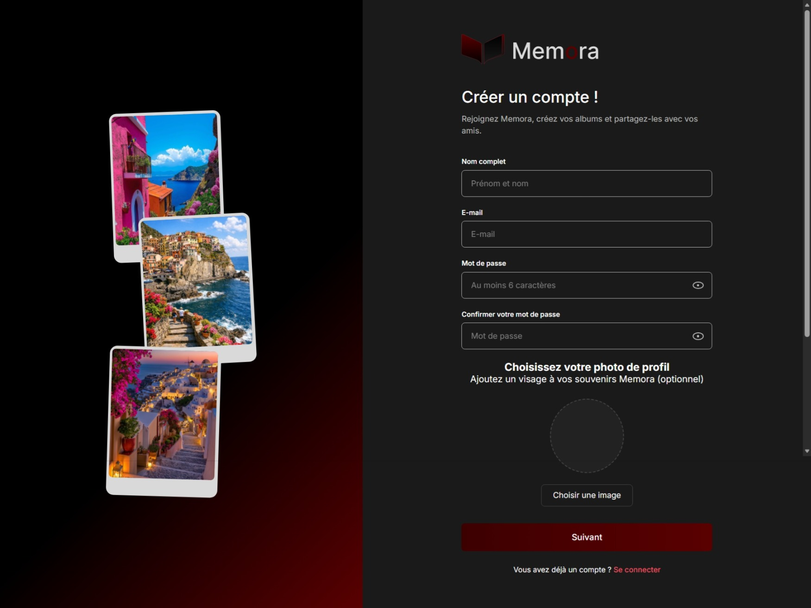
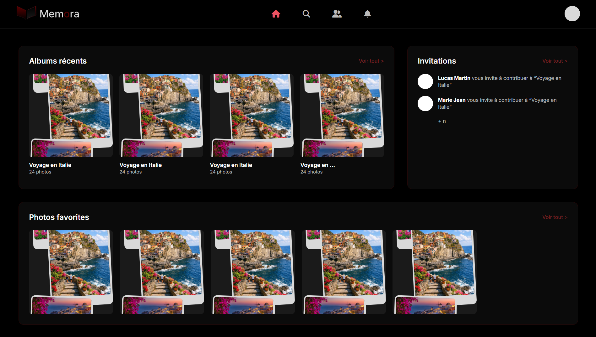
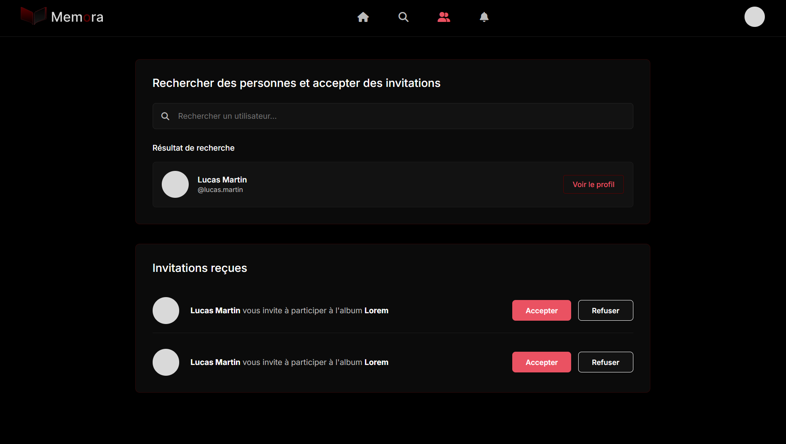
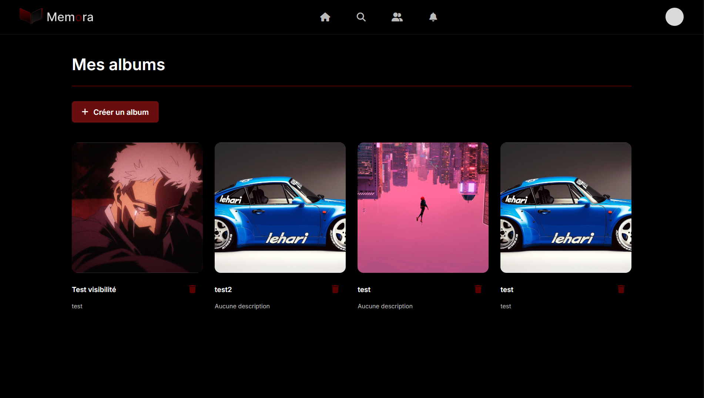
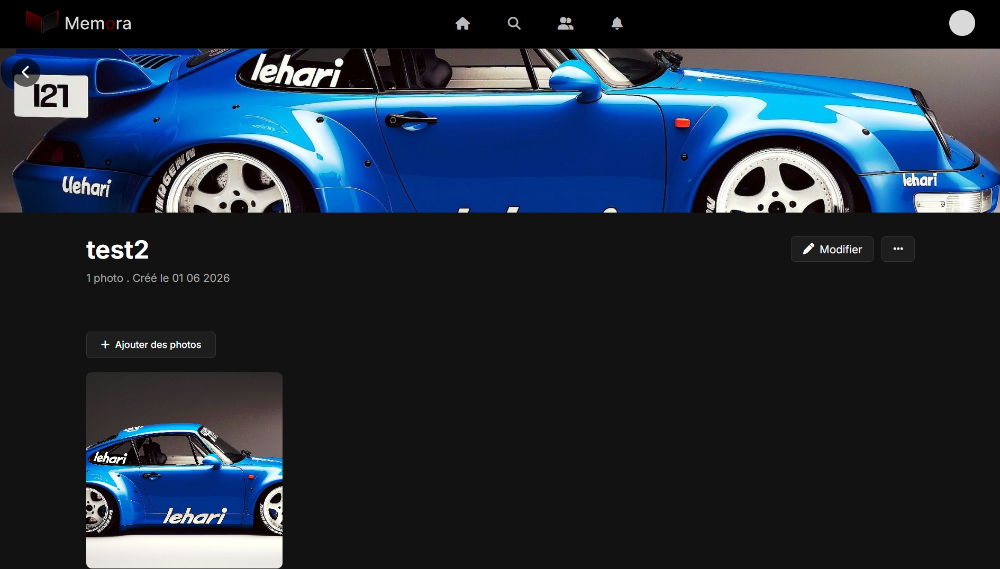
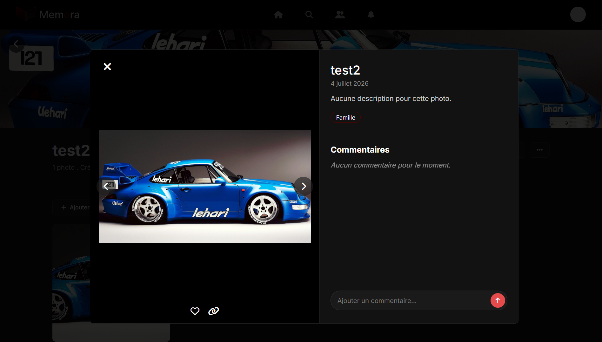
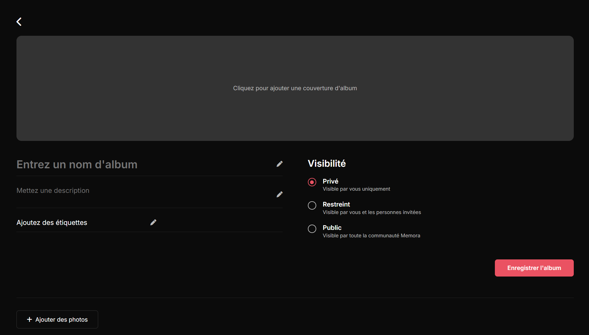
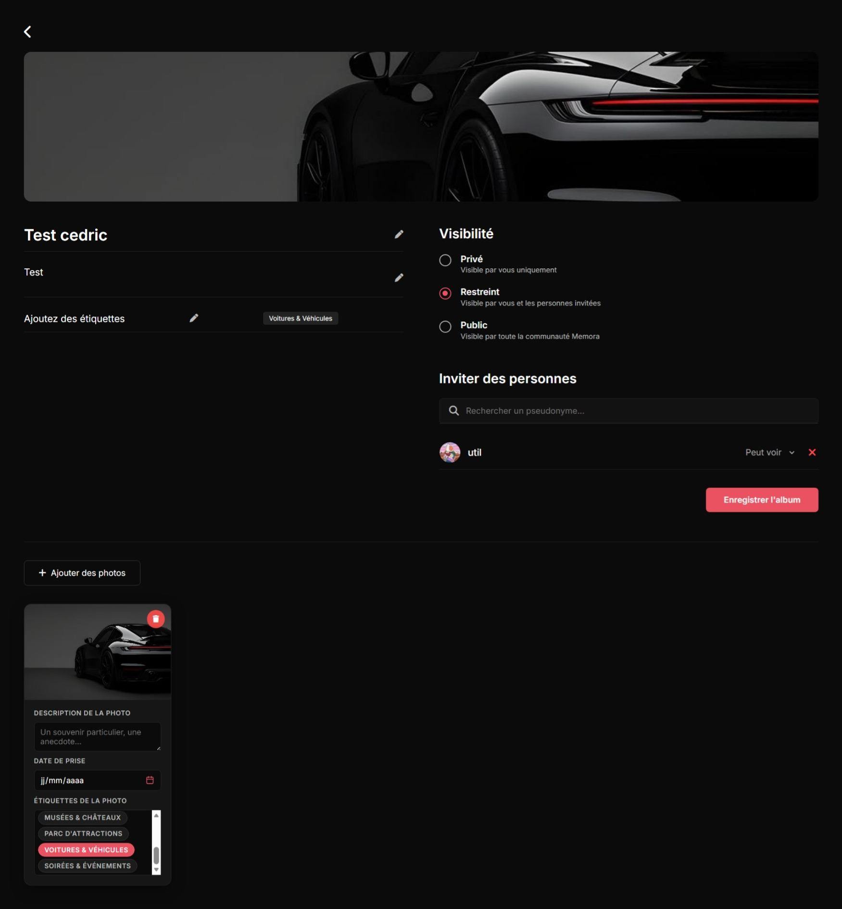

# Memora: Photo Album App

A web application for managing photo albums, allowing users to create and share albums.

## Purpose

Develop an application that enables users to:

- Create and organize photo albums
- Add photos with descriptions and tags
- Share albums with other users
- Comment on photos
- Manage access permissions (private, public, restricted)
- Search and filter photos

## Architecture

The application follows an **MVC (Model-View-Controller) architecture** with a clear frontend/backend separation:

```text
app-photo-album/
├── frontend/          # Client application (HTML, CSS, JavaScript)
└── backend/           # API and server-side logic (PHP, MySQL)
```

## Tech Stack

- **Frontend:** HTML5, CSS3, JavaScript
- **Backend:** PHP 8.5.6 (Object-Oriented Programming)
- **Database:** MySQL
- **Architecture:** MVC
- **Standards:** W3C

## Main Features

### Authentication

- User registration
- User login

### Album Management

- Create, edit, and delete albums
- Add photos to albums
- Tag albums and photos
- Photo upload

### Sharing & Permissions

- Set visibility (private, public, restricted)
- Invite users
- Manage permissions

### Comments

- Comment on photos
- Edit and delete comments
- Display comments

### Search & Filtering

- Search by tags
- Filter by date
- Search by album title

## Installation

### Clone the repository

```bash
git clone https://gitlab.com/your-username/app-photo-album.git
cd app-photo-album
```

## Use

### 1. Start the application with Docker

```bash
docker compose up -d
```

### 2. Access the application

Once the containers are running, open your browser and navigate to:

```text
http://your-ip/frontend/pages/login-signin/html/login.php
```

### 3. Stop the application

```bash
docker compose down
```

## Screenshots

### Login Page



### Register Page



### Dashboard Page



### Invitation



### Album



### Album View



### Album Details



### Create Album



### Create View


